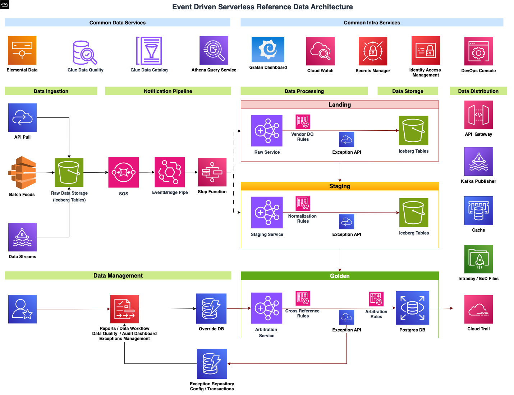

# MDP CloudFormation Orchestration

This repository automates end-to-end provisioning, cleanup, and testing for the **Market Data Platform (MDP)** prototype on AWS using **CloudFormation** and **AWS CLI**.

---
## High Level Architecture


## 🧱 Security Reference Data Platform — Layered Architecture

| **Layer** | **Service / Component** | **Purpose / Function** | **Partition Strategy / Update Behavior** | **Viable Alternatives** |
|-----------|--------------------------|-------------------------|------------------------------------------|--------------------------|
| **Data Ingestion** | **S3 (Vendor Buckets)** | Receives raw vendor files (BPIPE micro-batches, Refinitiv, Exchanges) | Partitioned by `dataset`, `file_date`; **append-only** | • **Managed:** AWS Transfer Family, Amazon Kinesis Data Firehose <br> • **Serverless:** Direct S3 Put via SDK, EventBridge Scheduler |
|  | **EventBridge (ObjectCreated)** | Detects new file uploads and generates events | N/A | • **Managed:** SNS Notifications <br> • **Serverless:** Lambda Trigger |
|  | **SQS Queue (Buffer)** | Buffers incoming messages to handle bursts | FIFO/Standard queue; retains unprocessed events | • **Managed:** Kinesis Data Streams <br> • **Serverless:** EventBridge Pipe internal buffer |
|  | **EventBridge Pipe** | Filters/throttles SQS messages; triggers Step Function | N/A | • **Managed:** Lambda poller <br> • **Serverless:** Step Function direct integration |
| **Data Processing** | **Step Function (Orchestrator)** | Coordinates Landing → Staging → Golden PySpark jobs | Sequential or parallel execution | • **Managed:** MWAA (Airflow) <br> • **Serverless:** Glue Workflows |
|  | **EMR Serverless (PySpark)** | Performs transformation, validation, enrichment | Partition on `file_date`, `dataset`; **upsert** using Iceberg | • **Managed:** Glue ETL Jobs <br> • **Serverless:** Lambda (light jobs) |
|  | **PySpark DQ Jobs** | Vendor-specific validation & cleansing | Partition by `dataset`, `file_date`; **append-only** | • **Managed:** AWS Deequ on Glue <br> • **Serverless:** Lambda DQ Functions |
|  | **Normalization / Cross-Reference** | Canonicalization, mapping to standard schema | Partition by `vendor`, `file_date`; **merge/upsert** | • **Managed:** Glue ETL <br> • **Serverless:** EMR Serverless |
|  | **Arbitration Rules** | Apply precedence across vendors | N/A | • **Managed:** Glue ETL <br> • **Serverless:** Lambda |
| **Data Storage** | **S3 Landing (Iceberg)** | Clean, validated vendor data | Partition: `dataset`, `file_date`; **append-only** | • **Managed:** Glue Tables <br> • **Serverless:** Athena CTAS |
|  | **S3 Staging (Iceberg)** | Normalized canonical data | Partition: `dataset`, `file_date`; **upsert/merge** | • **Managed:** Glue Tables <br> • **Serverless:** Athena Iceberg |
|  | **Postgres (Golden Copy)** | Latest version with precedence & overrides | Keyed by `security_id`; **upsert** | • **Managed:** RDS Postgres <br> • **Serverless:** Aurora Serverless |
|  | **S3 (Historical Parquet)** | Time-versioned snapshots for Redshift sync | Partition: `security_id`, `as_of_date`; **append-only** | • **Managed:** S3 Inventory <br> • **Serverless:** Iceberg time-travel tables |
|  | **Redshift (Historical Data)** | Stores all historical versions for backtesting | Partition: `as_of_date`; **merge/upsert** via COPY | • **Managed:** Redshift Serverless <br> • **Serverless:** Athena Iceberg (time-travel) |
| **Data Distribution** | **Distribution Gateway (Python)** | Unified API + Kafka publisher + cache updater | Stateless; IAM/JWT-secured | • **Managed:** API Gateway + Lambda <br> • **Serverless:** ECS Fargate |
|  | **Kafka Publisher** | Publishes updates downstream | Schema via Glue Registry (Avro) | • **Managed:** MSK <br> • **Serverless:** Kinesis Data Streams |
|  | **API Gateway** | Consumer access endpoint | N/A | • **Managed:** AppSync GraphQL <br> • **Serverless:** Lambda URLs |
|  | **Cache (ElastiCache)** | Low-latency reads for hot securities | Key: `security_id`; TTL policy | • **Managed:** DynamoDB Accelerator <br> • **Serverless:** CloudFront Edge Cache |
| **Data Governance** | **Glue Data Catalog** | Schema & metadata store | Auto-updated by jobs | • **Managed:** Lake Formation <br> • **Serverless:** Athena Glue sync |
|  | **Glue Schema Registry (Avro)** | Enforce schema evolution for Kafka | N/A | • **Managed:** Confluent Schema Registry |
| **Data Control / Observability** | **CloudWatch / Grafana** | Monitor pipelines & metrics | N/A | • **Managed:** OpenSearch Dashboards <br> • **Serverless:** CloudWatch Logs Insights |
|  | **Exception Repository** | Logs rejected/failed records | Stored in S3 or DynamoDB | • **Managed:** DynamoDB <br> • **Serverless:** S3 + Athena |
|  | **Notifications (SNS / Email)** | Alerts for job/DQ failures | N/A | • **Managed:** EventBridge Rules <br> • **Serverless:** Slack ChatOps |

## 🧰 Prerequisites

Ensure the following tools are installed and configured before running any scripts:

- **AWS CLI v2** (configured with appropriate IAM permissions)
- **jq** (for JSON parsing)
- **yq** (for YAML parsing)
- **bash** (Mac/Linux terminal or WSL)
- Optional: `zsh` with helper functions

Grant execute permissions to all scripts:

```bash
chmod +x manage.sh deploy.sh cleanup.sh tests.sh
```

---

## ⚙️ Shell Helper Functions (add to `~/.zshrc` or `~/.bashrc`)

```bash
cf_list() { aws cloudformation list-stacks --stack-status-filter CREATE_COMPLETE UPDATE_COMPLETE --output table; }
cf_out()  { aws cloudformation describe-stacks --stack-name "$1" --query "Stacks[0].Outputs[].[OutputKey,OutputValue]" --output table; }
cf_del()  { aws cloudformation delete-stack --stack-name "$1" && aws cloudformation wait stack-delete-complete --stack-name "$1"; }
cf_deploy() { aws cloudformation deploy --stack-name "$1" --template-file "$2" "${@:3}"; }
cf_logs() { aws logs describe-log-groups --query "logGroups[?contains(logGroupName, '$1')].logGroupName" --output text | xargs -n1 aws logs tail --follow; }
```

Reload your shell after editing:
```bash
source ~/.zshrc
```

---

## 🧹 Cleanup

Preview cleanup:
```bash
./manage.sh cleanup --dry-run
```

Execute cleanup (empties S3 buckets and deletes stacks in dependency order):
```bash
./manage.sh cleanup
```

---

## 🚀 Deployment

```Examples
./manage.sh deploy --only mdp-s3-raw-event           # deploy just one stack
./manage.sh deploy --upto mdp-sfn-stub               # stop at SFN stub
./manage.sh deploy --skip mdp-warehouse-buckets      # skip warehouse
./manage.sh deploy --continue-on-error --retries 1   # retry on failure
./manage.sh deploy --dry-run                         # preview plan
```

``` Stacks deployed in order:
1. **mdp-s3-raw-events** → S3 + EventBridge + SQS
2. **mdp-sfn-stub** → Step Function stub
3. **mdp-warehouse-buckets** → Warehouse + Athena results
4. **mdp-athena-ddl** → Athena DB + Iceberg Bronze tables
```

Full deployment:
```bash
./manage.sh deploy
```

Selective deployments:

```bash
./manage.sh deploy --only mdp-s3-raw-events
./manage.sh outputs --stack mdp-s3-raw-events
``` 

```bash
./manage.sh outputs --stack mdp-sfn-stub
./manage.sh outputs --stack mdp-sfn-stub
```

```bash
./manage.sh deploy --only mdp-warehouse-buckets
./manage.sh outputs --stack mdp-warehouse-buckets
```

```bash
./manage.sh deploy --only mdp-athena-ddl
./manage.sh outputs --stack mdp-athena-ddl
```
---

## 🧪 Tests

Smoke tests for EventBridge → SQS and Athena checks:

```bash
./manage.sh test --vendor both --print-keys --delete-after
./manage.sh test --json-only --max-wait 20
./manage.sh test --drain-first --vendor both
```

Drain queue only:
```bash
./manage.sh test --drain-only
```

Run with specific Event stack:
```bash
./manage.sh test --events-stack mdp-s3-raw-events --vendor both --print-keys
```

---
# Athena tests

Smoke only
```bash
./tests.sh --athena-smoke
```

Full cycle
```bash
./tests.sh --athena
```

Full + cleanup
```bash
./tests.sh --athena --athena-clean
```

---

## 📊 Outputs and Logs

View stack outputs:
```bash
./manage.sh outputs --stack mdp-s3-raw-events
```

Tail logs for debugging:
```bash
./manage.sh logs --stack mdp-athena-ddl
```

---

## 📁 File Overview

| File | Description |
|------|-------------|
| `manage.sh` | Main entrypoint wrapper for deploy/test/cleanup |
| `deploy.sh` | Direct sequential deploy script |
| `cleanup.sh` | Empties buckets and deletes stacks |
| `tests.sh` | Uploads S3 objects and validates SQS + Athena |
| `00-s3-events.yml` | Raw S3 buckets, EventBridge, SQS |
| `01-sfn-stub.yml` | Step Function stub |
| `02-warehouse-buckets.yml` | Warehouse + Athena results buckets |
| `03-athena-ddl.yml` | Athena database and Bronze Iceberg tables |

---

## ✅ Example Workflow

```bash
./manage.sh cleanup --dry-run
./manage.sh cleanup
./manage.sh deploy
./manage.sh test --vendor both --print-keys --delete-after
./manage.sh outputs --stack mdp-s3-raw-events
```

---

## 🧠 Tips

- Use `--dry-run` for safe previews
- Use `--continue-on-error` when iterating
- Always clean up before re-deploying changed templates
- Athena queries go to `athena-results` bucket (can be inspected via S3 console)

---

## aws cloud formation direct commands
## list all stacks
aws cloudformation list-stacks \
  --stack-status-filter CREATE_COMPLETE UPDATE_COMPLETE UPDATE_ROLLBACK_COMPLETE \
  --query "StackSummaries[].[StackName, StackStatus, CreationTime]" \
  --output table

## query a specific stack
aws cloudformation list-stacks \
  --stack-status-filter CREATE_COMPLETE UPDATE_COMPLETE UPDATE_ROLLBACK_COMPLETE \
  --query "StackSummaries[?starts_with(StackName, 'mdp-cfn-notify')].[StackName, StackStatus]" \
  --output table